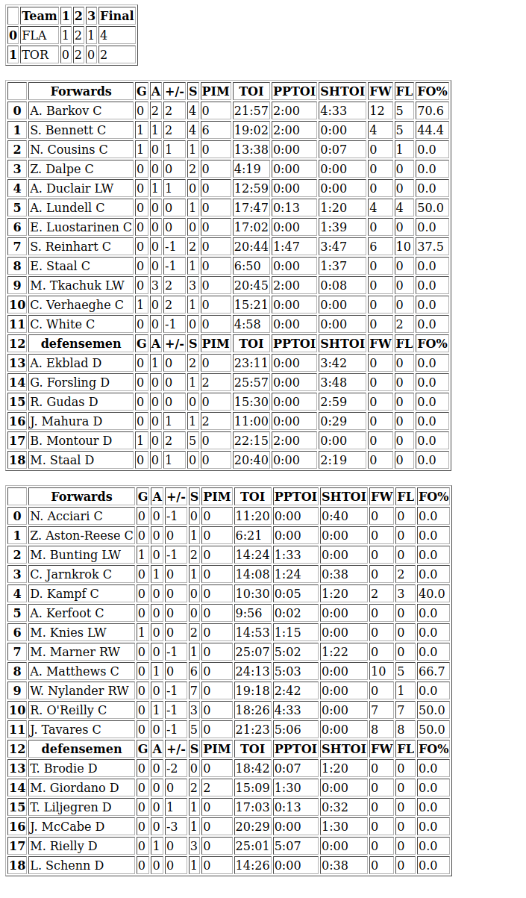

# NHL stats scraper

NHL stats scraper is a web scraper for scraping results and player stats from past NHL games. It will scrape the data from ESPN's web site and save it to HTML file.

## Usage

By default the program will scrape data of yesterday's games. This can be changed by modifying the timedelta(1).

## Example result

## About the project
this project was implemented as part of the Python basics course. I wanted to learn web scraping and i am also huge fan of NHL and data nerd so i chose this subject and also studied the basics of Beautifulsoup and Pandas. I am also interested to learn analyzing and working with data so this is great way to gather some data for that.
